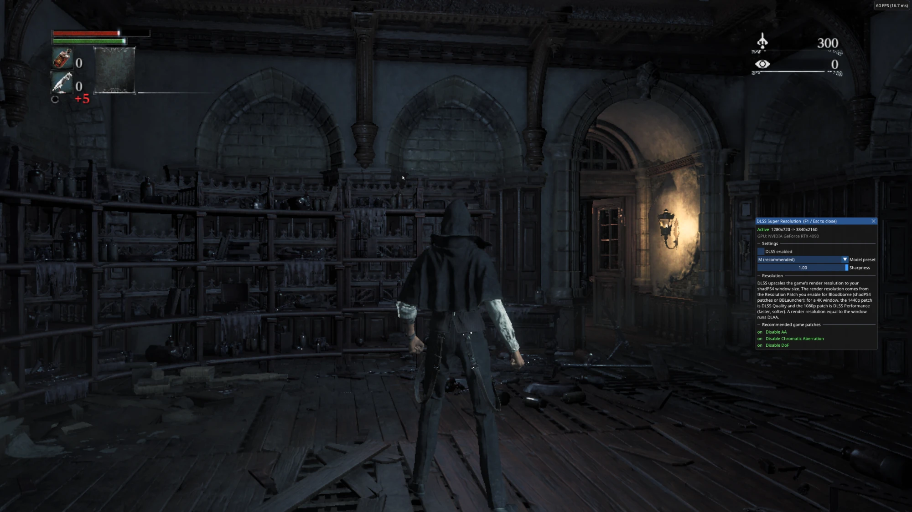
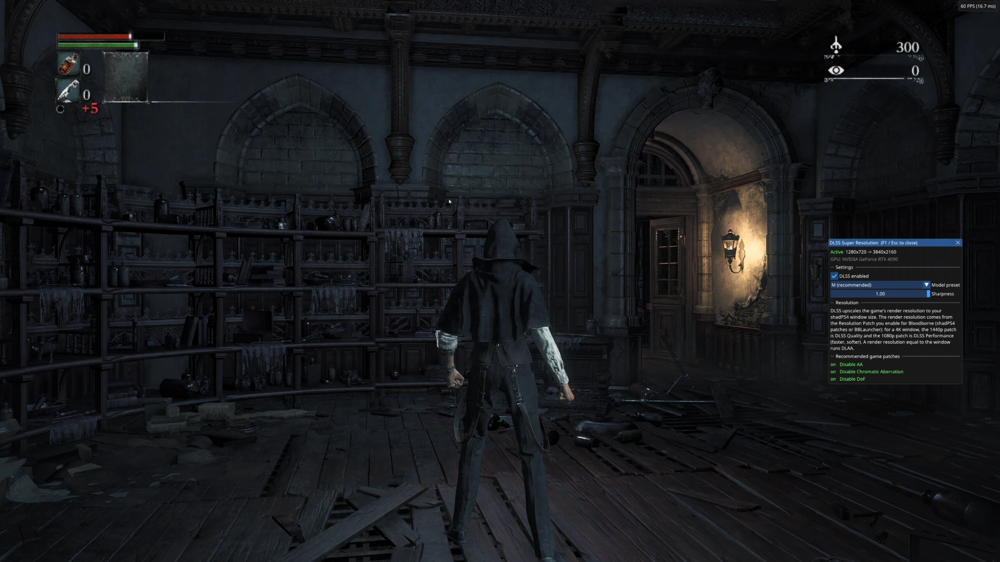

<!--
SPDX-FileCopyrightText: Copyright 2026 IFreemz
SPDX-License-Identifier: GPL-2.0-or-later
-->

# shadPS4 Bloodborne DLSS & FSR

Temporal upscaling for Bloodborne on [shadPS4](https://github.com/shadps4-emu/shadPS4): NVIDIA
DLSS Super Resolution on GeForce RTX cards, AMD FSR 3.1 on everything else. Frame generation
can raise the frame rate on top: DLSS Frame Generation on RTX 40 and 50 series cards (up to 4x
with Multi Frame Generation on RTX 50), FSR frame generation on every other GPU.

This is a modified build of shadPS4 0.19.0. It renders the game at the resolution set by the
Bloodborne resolution patch (for example 2560x1440) and upscales it to your window (for example
3840x2160). It is real temporal upscaling: the scene is rendered with sub-pixel jitter and the
upscaler gets depth plus camera and character motion, so it rebuilds detail instead of just
sharpening a stretched image. The HUD is drawn on top afterwards so it stays crisp.

DLSS looks better, especially from low render resolutions; FSR 3.1 runs on any GPU, including
AMD, Intel and older NVIDIA cards. Without the upscaler DLLs next to the exe, the build behaves
exactly like normal shadPS4 0.19.0.

| 1280x720, DLSS off | 1280x720 upscaled to 3840x2160 with DLSS |
|---|---|
|  |  |

Same spot, rendered at 1280x720 in both shots; open them full size to compare.

## Requirements

- Windows 10 or 11, 64-bit
- Bloodborne v1.09 running in shadPS4 already (any region; tested with CUSA03173)
- For DLSS: an NVIDIA GeForce RTX card (20 series or newer) and a recent driver. The build ships
  DLSS 310.9.1 (DLSS 4.5).
- For DLSS Frame Generation: an RTX 40 or 50 series card, a recent driver, and Windows 10 20H1
  or newer with *Hardware-accelerated GPU scheduling* on (Windows display settings > Graphics)
- For FSR 3.1 upscaling and FSR frame generation: any GPU that runs shadPS4
- For the optional FSR 4 add-on: a GPU with INT8 dot products and compute shader derivatives,
  such as an AMD Radeon RX 6000 or newer, an NVIDIA RTX card or an Intel Arc card

## Install

1. Download the latest zip from [Releases](../../releases).
2. Copy `shadPS4.exe` and all the DLLs into the folder of the shadPS4 build you play with,
   replacing its `shadPS4.exe`. Back up the old one first if you want to switch back.
   - `shadps4_dlss.dll` and `nvngx_dlss.dll`: DLSS, only used on RTX cards
   - `amd_fidelityfx_vk.dll`: FSR 3.1 upscaling and FSR frame generation
   - `sl.*.dll` and `nvngx_dlssg.dll`: DLSS Frame Generation (NVIDIA Streamline), only loaded
     when you turn frame generation on
3. In the Bloodborne patches (shadPS4 patch manager, or the Patches tab in BBLauncher), enable:
   - a **Resolution Patch** (see the table below)
   - **Disable AA**
   - **Disable Chromatic Aberration**
   - **Disable DoF**

   and make sure **Disable Motion Blur** is off (see below).
4. Start the game and press **F1** in gameplay. The panel should say *Active*, the upscaler and
   the resolutions.

Without a launcher, double-click `shadPS4.exe`: it opens shadPS4's game list (Big Picture
mode), where you pick Bloodborne. Launchers such as BBLauncher work as before.

To go back to normal rendering, delete the DLLs, or untick *Upscaling enabled* in the F1
panel.

**With BBLauncher:** unzip this build into a folder of its own. In BBLauncher, click *Manage
Builds*, then *Add Local Build*, pick this build's `shadPS4.exe` and give it a name. Tick it in
the *Selected* column and start the game from BBLauncher as usual. Don't copy the files over a
build BBLauncher downloaded: updating that build brings back the normal `shadPS4.exe`.

### Optional: FSR 4 add-on

FSR 4 is AMD's machine-learning upscaler, generally sharper and steadier than FSR 3.1. It is
mainly meant for Radeon and Intel Arc cards; RTX cards can run it too, but DLSS is the better fit
there. It comes as a separate download from
[Releases](../../releases), `shadPS4-Bloodborne-FSR4-addon-…-win64.zip`.

1. Unzip it and put the `fsr4` folder next to `shadPS4.exe` (the folder itself, not its
   contents).
2. Start the game. *Automatic* now uses FSR 4 on cards without DLSS, or pick *FSR 4 (add-on)*
   in the F1 panel. On RTX cards *Automatic* keeps DLSS.

To remove it, delete the `fsr4` folder. It works for output sizes up to 3840x2160 and costs
more GPU time than FSR 3.1, especially on mid-range cards. For 2x and 3x upscaling it uses FSR 4's
balanced model: the performance models leave trails behind moving characters in this game.

The add-on runs the FSR 4 "v07" INT8 model through [FSR-Vulkan](https://github.com/FireBurn/FSR-Vulkan),
with the model files built by the Q2RTX project from the FSR 4 source code AMD published under
the MIT license. It is not AMD's official FSR 4.1 DLL, which exists only for DirectX 12. It is
kept separate from the main download so the main build does not depend on it.

### Frame generation

Tick *Frame generation* in the F1 panel and restart the game. The game then shows generated
frames between the ones it renders, so 60 fps becomes 120 on screen (or more with Multi Frame
Generation). It uses the same depth, motion and camera data as the upscaler, and the F1 panel
and fps counter are kept still in the generated frames. *Frame gen FPS counter* in F1 shows the
game's frame rate and the displayed one in the top-left corner of the game image; next to the
tick, F1 shows which frame generation runs and both frame rates (for example "FSR 60 -> 120").

*Frame gen type* picks which one is used (restart to apply):

| | Cards | Notes |
|---|---|---|
| **Automatic** (default) | all | DLSS on RTX 40 and 50 series, FSR on everything else |
| **DLSS** | RTX 40/50 | NVIDIA's AI frame generation; Multi Frame Generation on RTX 50 |
| **FSR** | any GPU | AMD FSR 3.1 frame generation; one generated frame per rendered one |

With DLSS, *Frame gen multiplier* appears in F1 when the card can generate more than one frame
(RTX 50 series): 2x, 3x or 4x. Pick it so that the game's frame rate times the multiplier is
close to your monitor's refresh rate, for example 60 fps x 4 on a 240 Hz screen; frames above
the refresh rate are wasted. *Reflex low latency* (DLSS only) lowers the input delay, but on
some setups it also lowers the game's frame rate; try it and see.

To get the most out of it:

- **Use a 60 fps base.** Frame generation holds back a rendered frame while it generates the
  ones before it, which adds input delay; at 60 fps that is small, at 30 it is noticeable. At
  30 fps the generated frames also show smearing around moving characters, more so at 3x and
  above. Use *Uncap FPS++* or *60 FPS++* with a vblank of 60 in shadPS4's settings.
- **Leave the GPU some headroom.** Frame generation has a cost of its own, about 2-3 ms per
  frame at 4K. If the GPU is already near its limit, the game's own frame rate drops below 60
  and becomes uneven, and frame generation then stutters instead of smoothing. Use a lower
  render resolution to keep the base frame rate steady: for example native 1080p (no
  Resolution Patch) on a 4K screen, or the 1280x720 patch on a 1440p screen.
- **Turn off the NVIDIA app overlay** (and other overlays drawn on top of the game). An overlay
  window makes Windows compose the desktop, which drops generated frames and adds latency.
- **Use Fullscreen or Fullscreen (Borderless)** and keep the game focused: frame generation
  pauses while the window is in the background. With DLSS and *Fullscreen*, the build takes the
  display exclusively while frame generation is on.
- **Mailbox** as the present mode (shadPS4's default) works well.
- **Other base frame rates work too**: *Uncap FPS++* with a vblank of 45 gives 45 to 90 with
  2x. Pick a rate your PC holds steadily; a steady base matters more than a high one. Outside
  frame limiters (RTSS, the NVIDIA app) don't cap generated frames reliably; pick the vblank
  instead.

It turns itself off in menus, loading screens and while the window changes size.

**Limitations**

- With FSR, Bloodborne's own HUD and menus ghost more than with DLSS when the camera moves or
  a menu opens: FSR only knows where the emulator's overlays are, not the game's HUD. A fix is
  planned.
- FSR generates one frame per rendered frame (2x); Multi Frame Generation is DLSS only.
- With the RenoDX HDR mod, frame generation always uses FSR: DLSS-G doesn't generate frames on
  its HDR output. The game's HUD may ghost a little more there.

**Tested setups**

- RTX 4090, 4K 240 Hz, native 1080p rendering, *Uncap FPS++* with vblank 60: DLSS 60 to 120
  and FSR 60 to 120, with every frame displayed and even pacing (measured with PresentMon).
  With an unlock mod (see below), DLSS 3x and 4x look fine at 60 fps, with a little more
  input delay than 2x.
- By [@TheFurryMonk](https://github.com/TheFurryMonk)
  ([#4](https://github.com/IFreemz/shadPS4-Bloodborne-DLSS-FSR/issues/4)): RTX 5070 Ti,
  144 Hz G-Sync monitor at 1440p, with the 2560x1440 Resolution Patch (DLAA) and *1440p Light
  Grid*. vblank 60 with *Uncap FPS++* or *60 FPS++*, capped at 120 fps with RTSS (NVIDIA Reflex
  limiter, inject after frame presentation): the smoothest result. vblank 90 with *Uncap FPS++*
  or *90 FPS++* works but shows 180 fps, above the monitor's 144 Hz, so it judders and tears
  now and then; best with a 180 Hz or faster monitor.

#### DLSS frame generation on other NVIDIA cards (unofficial mods)

NVIDIA limits DLSS frame generation to RTX 40/50 and Multi Frame Generation to RTX 50. Some
third-party mods lift those limits. This build doesn't include or support them, but it doesn't
block them either: it asks NVIDIA's Streamline what the card can do, like a normal game, so a
mod that changes that answer works here.

| Card | Mod | Gives | Status |
|---|---|---|---|
| RTX 20 / 30 | [RTX30MFG-Unlock](https://github.com/mcsoderh/RTX30MFG-Unlock) | frame generation and MFG | reported working on an RTX 30 card; RTX 20 untested by its author |
| RTX 40 | [RTX40MFG-Unlock](https://github.com/dashdogy/RTX40MFG-Unlock) | MFG (3x to 6x) | tested here on an RTX 4090 |
| RTX 50 | none needed | MFG up to 4x | native |

On AMD and Intel cards, use FSR frame generation instead.

To install one: put its DLL next to `shadPS4.exe` and name it `winmm.dll` (or `version.dll`;
shadPS4 also loads `dbghelp.dll` and `dxgi.dll`, but not `winhttp.dll` or `dinput8.dll`). Don't
replace any of this build's DLLs. Install **only one** unlock: they all patch the same part of
NVIDIA's frame generation, and two at once clash. Set the mod's own menu (Backspace) to
*Follow game* so that the *Frame gen multiplier* in F1 controls it; in its fixed mode it
overrides F1. On an RTX 40 card the extra frames come from NVIDIA's RTX 50 code running on
hardware it wasn't made for, so 3x and up show a little more ghosting than 2x.

These mods are unofficial and experimental: use them at your own risk, download them only from
their original page, and report problems with them to their authors.

Frame generation is NVIDIA's [Streamline](https://github.com/NVIDIA-RTX/Streamline) with DLSS-G
and Reflex, or AMD's FidelityFX SDK (FSR 3.1.4). It is only loaded when the setting is on;
otherwise the build runs as without it.

### Which resolution patch

The upscaler goes from the game's render resolution to your shadPS4 window size, keeping the
game's aspect ratio. The resolution patch sets the render resolution; any window size works.

| Window | Resolution Patch | Result |
|---|---|---|
| 3840x2160 | 2560x1440 | Quality mode (recommended for 4K) |
| 3840x2160 | none (native 1920x1080) | Performance mode, faster and a bit softer |
| 2560x1440 | none (native 1920x1080) | Quality mode |
| 2560x1440 | 2560x1440 | No upscaling, just anti-aliasing (DLAA / FSR Native AA) |
| 1920x1080 | 1280x720 | Quality mode, for slower GPUs |
| 1920x1080 | none (native 1920x1080) | Anti-aliasing only |

FSR shows its weaknesses more than DLSS from low render resolutions: on FSR, prefer a render
resolution of at least 1920x1080 for a 4K window.

If the render resolution is higher than the window, the upscaler only anti-aliases at the render
resolution and the result is scaled down to the window. The upscaler goes up to 3x per side; if
the window is larger than that, the rest is plain scaling.

Higher render resolutions need more VRAM. The resolution patch notes say to raise dmem in the
game-specific settings, and that still applies.

### Decoupled 1080p UI patches

The *Decoupled 1080p UI* patches render the scene at a lower resolution (for example 1280x720)
while the game keeps its UI at 1080p. The build detects them by itself: the scene is upscaled to
1080p with DLSS or FSR, and the game then adds its effects and draws its own sharp 1080p UI on
top. Use one of them instead of a regular Resolution Patch, not together with one. The 640x360,
960x540, 1280x720 and 1600x900 versions are supported. The 320x180 one and the versions above
1080p are not: with them the upscaler stays off (F1 says why) and the game looks as it would
without this build.

They are made for 1080p screens and low-VRAM setups. The final picture is 1080p, scaled to your
window, so on 1440p or 4K screens the regular Resolution Patches give a sharper image. FSR shows
more shimmer on thin detail from 720p and below; DLSS copes well. The Sharpness slider sharpens
the upscaled scene here too, before the game adds its effects.

### Other patches

Tested and working with the upscaler: *Performance Patch*, *rgba8f color space* and *lower
specific renders* (all "Perf Increase"), *HD Motion Blur* and *Optimal 1080p*. Keep *Better AA*
and *Enable TAA* off: they add the game's own anti-aliasing, which the upscaler replaces.

### Why the three "Disable" patches, and not Disable Motion Blur

The game blurs the image before the upscaler sees it: its own post-process AA softens edges,
chromatic aberration smears colour towards the screen edges, and depth of field blurs anything
that isn't in focus. With them off, the upscaler gets a clean image to work with.

**Disable Motion Blur (Perf Increase) must stay off.** It also removes the depth and motion data
the upscaler is built on, and the F1 panel then stays on *Waiting for gameplay*. You don't need
it: this build turns the game's motion blur off by itself (see *Game motion blur* below) and
keeps the data.

The F1 panel checks these patches and has a button that sets all four correctly; that takes
effect after a restart.

## Settings

Press **F1** in game. Mouse, keyboard and controller all work; the game ignores the controller
while the panel is open.

- **Upscaling enabled**: compare against the normal image at any time.
- **Upscaler**: *Automatic* uses DLSS when the card supports it, otherwise FSR 4 if its add-on
  is installed, otherwise FSR 3.1. You can also pick any of them by hand to compare.
- **DLSS model**: M is the default. K is the one NVIDIA recommends for this mode. J and L are
  there to experiment with. M and L are the DLSS 4.5 models, K and J the DLSS 4 ones.
- **Sharpness**: sharpening after upscaling, default 0.6. Set it to 0 if you prefer the plain
  look.
- **Game motion blur**: off by default. The game blurs the scene before the upscaler gets it,
  which leaves ghost trails around your character when the camera moves; with the blur off the
  image stays clean. Tick it if you want the game's blur back.
- **Frame generation**: off by default; takes effect after a restart (see *Frame generation*
  above). Once loaded, the tick switches it on and off right away.
- **Frame gen type**: Automatic, DLSS or FSR; takes effect after a restart.
- **Frame gen multiplier**: 2x to 4x with DLSS on cards that support Multi Frame Generation.
- **Reflex low latency**: with DLSS frame generation; less input delay, possibly fewer fps.
- **Frame gen FPS counter**: the game's frame rate and, with frame generation, the displayed
  one, in the top-left corner of the game image.
- **Menu fix**: on by default. While a menu covers most of the screen (inventory, pause menu),
  the game's own image is shown and the scene isn't jittered, so it can't shimmer behind the
  menu panels. Your frame rate is the same either way. Smaller popups keep the upscaled image.

The settings are saved in `dlss.ini` in your shadPS4 user folder (the `user` folder next to
`shadPS4.exe`, or `%APPDATA%\shadPS4` if there isn't one). You can also edit it by hand; changes
apply within a second.

## Troubleshooting

The F1 panel shows the reason when upscaling isn't running.

- **"not an NVIDIA GPU" / "does not support DLSS"**: DLSS needs an RTX card; the *Automatic*
  setting uses FSR instead. On laptops with two GPUs, make sure shadPS4 runs on the NVIDIA one
  (Windows graphics settings, or NVIDIA Control Panel).
- **"NGX initialization failed"**: update your NVIDIA driver.
- **"shadps4_dlss.dll is missing or from a different version"**: the exe and the DLL come from
  different releases. Copy all files from the same zip.
- **"FSR needs amd_fidelityfx_vk.dll"**: copy that DLL from the zip next to `shadPS4.exe`.
- **"FSR 4 needs the FSR 4 add-on" / "FSR 4 could not start"**: check that the `fsr4` folder
  sits next to `shadPS4.exe` with all its files, and that your GPU is in the requirements above.
  The shadPS4 log has the exact reason (search for `[FSR4]`).
- **The game crashes at boot after a "Config Migration" prompt**: you copied the files into a
  build that keeps its settings in `config.toml` (ShadLix and other forks). Use this release or
  newer, which carries the extra dmem over. Otherwise set *extra dmem* again (for example
  `"extra_dmem_in_mbytes": 8000` under `"General"` in `user/custom_configs/CUSA03173.json`); the
  resolution patches need it. Pick *Copy* if it asks about saves.
- **Stretched polygons, flickering or parts of the world missing**: GPU readbacks are off
  (*Disabled* is shadPS4's default). This happens with or without the upscaler. Press **F3**, go
  to *Experimental*, set *Readbacks Mode* to *Relaxed* and restart. The F1 panel warns about it.
- **Missing faces or arms (the Doll, your character) or other odd glitches**: close RivaTuner /
  MSI Afterburner (a per-game profile isn't enough) and the NVIDIA app overlay, and check that
  Readbacks Mode is *Relaxed*. Users also report it going away with an FPS patch that matches
  the vblank (*60 FPS++* with vblank 60, *90 FPS++* with vblank 90).
- **"DLSS Frame generation needs …"**: *Frame gen type* is set to DLSS and the F1 panel names
  what is missing: an RTX 40/50 card, a newer driver, or Windows' Hardware-accelerated GPU
  scheduling. On Automatic, the build uses FSR frame generation instead.
- **Crash on AMD Radeon cards when the upscaler starts**: a known issue being looked into
  ([#7](https://github.com/IFreemz/shadPS4-Bloodborne-DLSS-FSR/issues/7)). If it happens to you,
  please attach `user/log/shad_log.txt` there; the crash line names the module.
- **Frame generation is on but the screen isn't smoother**: close overlays such as the NVIDIA
  app overlay: it makes Windows compose the game instead of showing it directly, which drops
  generated frames and adds latency. Close RivaTuner too if it still isn't. Keep the game focused, and check the GPU isn't maxed out (see *DLSS Frame
  Generation* above).
- **"Waiting for gameplay"**: menus, the title screen and loading screens use the normal image;
  this is expected. If it stays like this in gameplay, check that Disable Motion Blur is off.
- **The F1 panel doesn't open**: check `input_config/global.ini` in the shadPS4 user folder for
  a line like `hotkey_toggle_dlss = f1`. You can bind it to another key there.
- **Screen flicker with G-SYNC / FreeSync**: this comes from uneven frame pacing in emulation, not
  from DLSS. Use an FPS patch that matches your vblank setting (for example 60 FPS++ with 60)
  rather than *Uncap FPS++*.

## FAQ

**FSR 4?** Yes, as the optional add-on described under Install. AMD only ships its official
FSR 4.1 for DirectX 12; the add-on uses the community Vulkan port of the FSR 4 v07 model.

**XeSS?** Not included. FSR 3.1 already covers Intel cards.

**Frame generation?** Built in: DLSS frame generation on RTX 40 and 50 series (Multi Frame
Generation up to 4x on RTX 50), FSR frame generation on every other GPU. See *Frame generation*
above, including the unofficial mods for DLSS frame generation on RTX 20, 30 and 40 cards.
XeSS frame generation is DirectX 12 only, so it can't be used with shadPS4.

**HDR?** The RenoDX HDR mod (ReShade 6.8.0 or newer) works with this build. Upscaling with it
needs one of the **Decoupled UI** resolution patches: there the game does its own HDR output
after the upscale. With other resolution patches the F1 panel says so and the game runs without
upscaling. Turn the **Disable AA** patch off with RenoDX: with it, skin turns blue. F1 warns about
it and its patch button turns it off. Without RenoDX nothing changes. A driver-level SDR-to-HDR
feature such as NVIDIA RTX HDR also works.

**Other games?** No. The integration depends on how Bloodborne renders: which shaders draw the
HUD, where its camera matrices live and which passes write motion data.

**Linux or Steam Deck?** No. The upscaling part is Windows-only for now.

**Is this an official shadPS4 release?** No. It is a separate build based on shadPS4 0.19.0.
Please don't report problems with it to the shadPS4 team; open an issue here instead.

## How it works

For anyone curious, or anyone porting this to a newer shadPS4:

- **Jitter**: draws into the main scene depth buffer get a sub-pixel viewport offset from a
  Halton(2,3) sequence. Full-screen passes and HUD draws are not jittered.
- **Camera motion**: the view and projection matrices come from the game's scene constants, and
  the previous-to-current transform is built in double precision. The game also has a
  ready-made reprojection matrix for its motion blur, but it is computed in float32 with large
  world coordinates, and its rounding noise of about 0.6 px made the image shimmer.
- **Object motion**: the game's own velocity draws are replayed at full resolution into a
  separate buffer and used where they cover the screen. The camera motion fills in elsewhere.
  The replay needs the game's depth scaled up to full resolution: a blit does that where the GPU
  can blit depth, and a few small draws do it elsewhere (AMD).
- **Where the upscaler runs**: at the first HUD draw, on a copy of the finished scene. When the
  game copies the frame to the screen, the HUD is added back from its own render and the game's
  brightness/gamma table is applied at output resolution.
- **HUD and menus**: the HUD is treated as a dimming of the scene plus an overlay, so darkening
  overlays dim the upscaled image instead of mixing in the render-size one. When the HUD changes
  most of the screen (a menu), the game's own frame is shown and jitter pauses.
- **Frame pacing**: the emulator's vblank timer sleeps until shortly before each deadline and
  waits out the rest precisely, so frames reach a VRR display at even intervals.
- **Decoupled UI patches**: the game upscales its HDR scene to the 1080p UI resolution in one
  copy pass before its post-processing. When that pass gets a smaller scene, the build replaces
  it with DLSS/FSR on the HDR scene (with automatic exposure), and the game post-processes and
  draws its UI as usual. The scene depth for jitter comes from the draws into that HDR scene.
- **Motion blur**: the game blurs the HDR scene in two full-screen passes along a motion buffer
  it builds from depth and its velocity draws. With *Game motion blur* off, those two passes are
  replaced by plain copies, so the motion data is still there for the upscaler.
- **DLSS and FSR get the same inputs**: colour, depth, motion vectors and jitter in render
  pixels. FSR also gets the camera's near/far planes and field of view from the scene constants.
- **NVIDIA code**: shadPS4 itself contains no NVIDIA code. `shadps4_dlss.dll` (source in
  [`dlss_bridge/`](dlss_bridge)) is a small bridge that links the DLSS SDK and is loaded at
  runtime when present.
- **AMD code**: `amd_fidelityfx_vk.dll` is AMD's signed FidelityFX SDK 1.1.4 build, loaded at
  runtime when present. Only its API headers are in this repository
  ([`externals/ffx-api`](externals/ffx-api)).
- **FSR 4 add-on**: `fsr4/shadps4_fsr4.dll` (source in [`fsr4_addon/`](fsr4_addon)) links
  FSR-Vulkan's FSR 4 v07 provider and loads the model files next to it. When the folder is
  present, the device also enables INT8 dot products and compute shader derivatives, which
  the model passes use. It gets the same inputs as DLSS and FSR 3.1, with the colour
  converted to linear light first, since FSR 4 has no setting for display-encoded input.

- **Frame generation**: NVIDIA Streamline is loaded before the Vulkan instance is created and
  hands out its versions of the instance, device and swapchain functions, so it can add what
  DLSS-G needs and present the generated frames. Each upscaled frame copies its depth and motion
  into a small ring of images that stay unchanged until the frame is presented, with the camera
  matrices for that frame. At present time the build also gives DLSS-G the window without the
  emulator's overlays and a mask of where they are, so they are not moved with the scene.
  Reflex markers are set around presenting, as DLSS-G requires.
- **FSR frame generation**: when it is used, the device gets extra queues (one to present from,
  one to acquire images on and a compute queue) and the swapchain is created through AMD's
  frame generation swapchain, whose acquire and present replace the normal ones. Each frame it
  gets the same depth, motion and camera data as DLSS-G and the window without the emulator's
  overlays; it generates and presents the in-between frame from its own threads.

Menus, the title screen and loading screens are not upscaled; they show the normal image.

## Building

The emulator builds like normal shadPS4 (see [documents/building-windows.md](documents/building-windows.md))
and doesn't need the DLSS SDK.

The bridge needs the [NVIDIA DLSS SDK](https://github.com/NVIDIA/DLSS):

```
cmake -S dlss_bridge -B build-dlss -G Ninja -DCMAKE_BUILD_TYPE=Release -DDLSS_SDK_ROOT=<path to DLSS SDK>
cmake --build build-dlss
```

The FSR 4 add-on needs [FSR-Vulkan](https://github.com/FireBurn/FSR-Vulkan) and the Vulkan SDK
(or a `vulkan-1` import library via `-DVULKAN_LIBRARY`):

```
cmake -S fsr4_addon -B build-fsr4 -G Ninja -DCMAKE_BUILD_TYPE=Release -DFSR_VULKAN_ROOT=<path to FSR-Vulkan>
cmake --build build-fsr4
```

Its model files are `fsr4_model_v07_i8_*`, `rcas.spv` and `spd_auto_exposure.spv` from
[Q2RTX's `baseq2/fsr4_shaders`](https://github.com/FireBurn/Q2RTX/tree/ae8d628fae208813172446d1e49ed94150b04658/baseq2/fsr4_shaders).

Frame generation needs the headers of the [Streamline SDK](https://github.com/NVIDIA-RTX/Streamline/releases)
2.14.1: add `-DBB_STREAMLINE_DIR=<path to the Streamline SDK>` when configuring the emulator. The
`sl.*.dll` files and `nvngx_dlssg.dll` come from its `bin/x64` folder.

`nvngx_dlss.dll` comes from the SDK (`lib/Windows_x86_64/rel`). `amd_fidelityfx_vk.dll` comes
from the [AMD FidelityFX SDK v1.1.4](https://github.com/GPUOpen-LibrariesAndSDKs/FidelityFX-SDK/tree/v1.1.4)
(`PrebuiltSignedDLL`).

## AI disclosure

An AI coding agent was used in the development of this project.

## Credits

- [shadPS4](https://github.com/shadps4-emu/shadPS4) and its contributors, for the emulator this
  is built on.
- deadinside28's [bloodborne_pc](https://github.com/deadinside28/bloodborne_pc), whose notes on
  Bloodborne's scene constants and on viewport jitter for scene geometry were the starting
  point for the camera motion and jitter here, and whose FSR 4 integration the add-on follows.
- FireBurn's [FSR-Vulkan](https://github.com/FireBurn/FSR-Vulkan), which runs FSR 4 on Vulkan, and
  the Q2RTX project, which built the FSR 4 v07 model files.
- The authors of the Bloodborne patches for shadPS4 (Kyo, illusion and others), including the
  resolution patches and the AA, chromatic aberration and depth-of-field patches recommended
  above.
- NVIDIA, for DLSS, Streamline and Reflex, and AMD, for FSR and the open FidelityFX SDK.

## License

- shadPS4 and the changes to it: GPL-2.0-or-later, see [LICENSE](LICENSE).
- The DLSS bridge in `dlss_bridge/`: MIT, see [dlss_bridge/LICENSE.txt](dlss_bridge/LICENSE.txt).
- `nvngx_dlss.dll` and `nvngx_dlssg.dll` are distributed under the NVIDIA DLSS SDK license and
  are not covered by the licenses above.
- The Streamline DLLs (`sl.*.dll`) are NVIDIA's Streamline SDK, MIT.
- `amd_fidelityfx_vk.dll` and the headers in `externals/ffx-api/` are from the AMD FidelityFX SDK,
  MIT, see [externals/ffx-api/LICENSE.txt](externals/ffx-api/LICENSE.txt).
- The FSR 4 add-on: its wrapper is GPL-2.0-or-later and FSR-Vulkan inside it is MIT. The model
  files carry the MIT notice of the FSR 4 source they were built from; the add-on zip includes
  all three license texts.

NVIDIA, GeForce RTX and DLSS are trademarks of NVIDIA Corporation. AMD and FidelityFX are
trademarks of Advanced Micro Devices, Inc. Bloodborne is a trademark of Sony Interactive
Entertainment; this project is not affiliated with Sony, FromSoftware, NVIDIA, AMD or the
shadPS4 team, and includes no game files.
